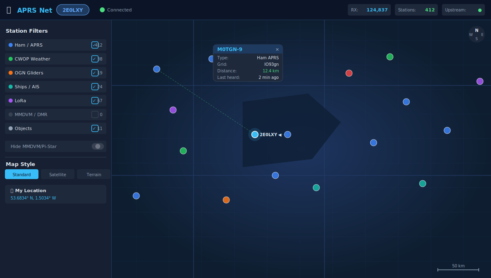

# Advanced APRS Go Server

A high-performance, self-hosted APRS-IS gateway written in Go. Provides a real-time tactical map dashboard, full APRS-IS TCP/UDP server, WebSocket and REST APIs, a complete member account system with cross-device messaging and settings sync, Ecowitt weather station APRS WX beaconing, geo-fence alerting, and a browser-based admin interface.

Live instance: **[www.aprsnet.uk](https://www.aprsnet.uk)**

[](https://github.com/2E0LXY/Advanced-APRS-Go-server/releases)
[](https://www.gnu.org/licenses/gpl-3.0)


---

## Client Applications

The server powers four dedicated clients — all open source under GPL v3:


| Client | Platform | Repository | Download |
|--------|----------|------------|----------|
| **APRS Net Android** | Android 8+ | [2E0LXY/APRS-Android](https://github.com/2E0LXY/APRS-Android) | [APK / AAB](https://github.com/2E0LXY/APRS-Android/releases) |
| **APRS Net iOS** | iOS 17+ | [2E0LXY/APRS-iOS](https://github.com/2E0LXY/APRS-iOS) | [Simulator build](https://github.com/2E0LXY/APRS-iOS/releases) |
| **APRS Client** (Windows/Linux) | Windows 10/11, Debian/Ubuntu | [2E0LXY/APRS-Client](https://github.com/2E0LXY/APRS-Client) | [EXE / DEB](https://github.com/2E0LXY/APRS-Client/releases) |
| **Web dashboard** | Any browser | this repo | [www.aprsnet.uk](https://www.aprsnet.uk) |

---

## Features

### 🗺 Real-time Map Dashboard

- Live station map — OpenStreetMap, Terrain, and Satellite tile layers
- 40+ APRS symbol types rendered from the standard symbol tables
- Position trails, PHG transmitter range circles, solar day/night terminator
- **TOCALL-based station classification** — firmware-accurate detection of LoRa (`APLRG*`, `APLRT*`, `APLG*`), MMDVM/DMR (`APZDMR*`, `APDG*`), and OGN (`APOG*`) alongside callsign-string heuristics
- CWOP weather stations detected by payload symbol (`_`) not just callsign prefix
- Station type filters: Ham APRS, CWOP Weather, OGN Gliders, LoRa, MMDVM/DMR, Ships/AIS, Objects
- **Station clustering** with zoom-based auto-expand
- **Station Ghosting** — stations not heard for 30+ minutes fade and pulse; snaps back on new packet
- **Auto-fit zoom** — optional automatic pan/zoom to keep all visible stations on screen
- **Smart search** (Ctrl+K) — cross-searches callsigns, comments, messages, and devices
- **Time-lapse replay** — re-plays station history at 10×–240× speed for selected time windows
- **Propagation analytics** — reliability grades, longest RF paths, 7-day activity heatmap, best-time histogram
- Click any marker to open a station detail modal (overview, last packets, path, history)
- Click any callsign to open the QRZ.com operator profile

### 📡 APRS-IS Gateway

- Connects to any APRS-IS Tier 2 server as a verified client
- Full APRS-IS login/logresp handshake with callsign verification
- Q-construct injection (`qAC`, `qAU`), duplicate suppression (60-second cache), automatic reconnection
- Configurable subscription filter with in-browser visual builder
- Server-wide drop filters for Pi-Star/MMDVM, D-STAR, and APDESK traffic

### 📱 TCP APRS-IS Client Server (port 14580)

- Standard APRS-IS protocol — compatible with APRSDroid, YAAC, APRSIS32, Xastir, Direwolf
- Full login/logresp handshake; verified clients can inject packets upstream
- Keepalive `#` lines every 20 seconds per spec

### 🛰 UDP Hardware Tracker Support (port 14580)

- Stateless UDP listener for hardware trackers and IoT devices
- No login required — packets injected with qAU construct

### 💬 Messaging System

- Station-to-station APRS messaging via WebSocket authenticated clients
- **Direct member-to-member messaging** — bypasses APRS-IS, delivered instantly on the server WebSocket
- Automatic ACK generation per APRS spec
- **Offline message delivery** — messages stored when recipient is offline; delivered on next connection
- **Persistent message history** — all messages (sent and received) stored per member with `direction` field (`in`/`out`)
- **Cross-device message sync** — `GET /api/member/messages` returns full history; all native clients pull on login and on every WebSocket re-authentication
- **Real-time sent-message echo** — when a message is sent from any device, the server pushes a copy to all other active sessions belonging to the sender
- Desktop browser notifications, unread count badge, quiet hours
- Messages panel: conversation inbox sidebar + thread view + compose bar + 5-row traffic log strip
- Click-to-reply — tap a sender callsign in the messages panel to fill the compose field

### 🌤 Ecowitt Weather Station APRS WX Beaconing

Per-member weather station integration stored in the member account Settings panel:

- **Ecowitt API** — fetches real-time data from any Ecowitt station via `api.ecowitt.net` using Application Key, API Key, and MAC address
- Formats and beacons a standards-compliant APRS WX packet: `CALLSIGN-13>APRS,TCPIP*:@DDHHMMz/pos_WX_fields comment`
- All WX fields: wind direction, wind speed (mph), gust (mph), temperature (°F), rain 1h/24h/daily (1/100 inch), humidity (%), barometric pressure (0.1 mbar)
- Optional comment fields: solar radiation (W/m²), UV index, lightning strike count
- Configurable beacon interval: 30, 60, 90, or 120 minutes
- WX SSID configurable 1–15 (APRS convention: −13)
- Relative (sea-level) or absolute pressure selectable
- **Test Connection** button — proxied live API check returns current temp/RH/pressure
- Beaconing handled entirely server-side — no client app needs to stay open
- Routes via both the internal broadcast channel (all WS clients) and upstream APRS-IS

### 📍 Geo-fence Alerts

- Server-side geo-fence rules stored per member in `members.json`
- Rules evaluated on **every incoming position packet** — no polling, sub-second latency
- Alert types: **Station enters zone** / **Station leaves zone**
- Watch a specific callsign or `*` for any station
- Configurable zone name, lat/lon centre, radius (miles)
- When a transition fires, a `{"type":"alert","alert_type":"...","callsign":"...","message":"..."}` WebSocket frame is pushed to all live sessions belonging to the rule owner
- Synced to Android and iOS via the member REST API

### 🌊 Live AIS Ships

- Server subscribes to [aisstream.io](https://aisstream.io) and relays marine vessel positions to all connected clients
- Coverage: UK + NW European coastal waters (48–62 N, 12 W–5 E)
- API key configured in the Admin panel (`ais_stream_key`)
- Android and iOS apps support an independent **direct** aisstream.io connection

### 🌦 Weather Overlays

- Animated RainViewer rain-radar overlay (no key required)
- UK Met Office severe weather warnings, colour-coded yellow/amber/red (cached 5 min)

### 👤 Member Account System

- Member registration, login, session tokens (`X-Member-Token` header auth)
- Per-member callsign list (messages delivered to any owned callsign or SSID)
- **Watchlist** — monitor specific callsigns across all devices
- **Quiet hours** — suppress notification toasts and audio during a configured time window; badges still update silently
- **Map filter preferences** — `drop_pistar`, `drop_dstar`, `drop_apdesk` stored server-side
- **Real-time settings sync** — when preferences are saved from any client, the server immediately pushes a `{"type":"member_sync","data":{...prefs}}` WebSocket frame to all other active sessions belonging to that member; all native clients apply the change without requiring a re-login
- Password change endpoint
- MOTD (Message of the Day) — optional server-wide broadcast shown on login

### ⚙️ Admin Panel

- First-run setup wizard at `/setup`
- Hot-reload configuration, one-click self-update from GitHub (streams build progress)
- Change admin password, configure APRS-IS upstream server and filter
- Station-level traffic monitoring: connected clients table, recent packet log
- **Server Performance & Issues** — admin-only live health, seven-day CPU/memory/disk/queue and packet-rate history, restart detection, APRS-IS state, and MQTT connection/authentication diagnostics
- **API Keys** — issue/revoke API keys for the history and export endpoints
- **Webhooks** — configure HTTP POST endpoints triggered by position, message, or weather packets; retries on 5xx
- **Audit log** — timestamped record of all admin actions
- **Backup / Restore** — download and upload `members.json`
- **Ban list** — block callsigns server-wide

### 📊 Propagation & Network Analytics

- Activity meter and coverage meter with configurable high-activity alert threshold
- Reliability grades per station, longest RF path detection
- 7-day activity heatmap, best time of day histogram

---

## Installation (Debian 12)

### One-line Deploy
```bash
apt update && apt install -y git && \
git clone https://github.com/2E0LXY/Advanced-APRS-Go-server /opt/aprs-gateway && \
cd /opt/aprs-gateway && chmod +x install.sh && ./install.sh
```
Navigate to your domain on first visit — you will be redirected to `/setup`.

### Firewall Ports
| Port | Protocol | Purpose |
|------|----------|---------|
| 80 | TCP | HTTP (redirected to HTTPS by Caddy) |
| 443 | TCP | HTTPS web interface |
| 14580 | TCP | APRS-IS client connections |
| 14580 | UDP | Hardware tracker UDP submit |

### Manual Deploy One-liner
```bash
ssh root@yourserver 'cd /opt/aprs-gateway && git pull origin main && \
  /usr/local/go/bin/go build -o aprs_server . && systemctl restart aprs'
```

---

## Connecting Clients

### APRSDroid / Direwolf / YAAC / APRSIS32
Server: `your-domain.com`, Port: `14580`, SSL: **off**

### UDP Hardware Tracker
```bash
echo "M0XYZ>APRS,TCPIP*:=5342.10N/00130.50W-Test" | nc -u -w1 YOUR-IP 14580
```

---

## API Reference

### WebSocket — `wss://your-domain/ws`
```json
{ "type": "auth", "callsign": "M0XYZ", "passcode": "12345", "software": "MyApp 1.0" }
{ "type": "tx",   "packet":   "M0XYZ>APRS,TCPIP*:=5342.10N/00130.50W-Status"        }
```

**Inbound message types from server:**

| Type | Description |
|------|-------------|
| `auth_ack` | Authentication result (`status: "success"` or `"error"`) |
| `rx` | Incoming APRS packet (`packet` string + optional decoded `data` object) |
| `obj` | APRS object/item packet |
| `alert` | Geo-fence alert (`alert_type`, `callsign`, `message`) |
| `member_sync` | Real-time preferences push (`data` = preferences object) |
| `sys` | Server system message |
| `msg_history` | Message history replay block |

### REST Endpoints

| Endpoint | Auth | Description |
|----------|------|-------------|
| `GET /api/status` | No | Uptime, packet counts, upstream status, connected clients |
| `GET /api/history` | API key | Last 10,000 decoded position packets |
| `GET /api/version` | No | Running server version |
| `GET /api/analytics` | No | Reliability grades, longest paths, heatmap data |
| `GET /api/qrz/lookup?call=X` | No | QRZ.com operator profile (cached 24 h) |
| `GET /api/wx/warnings` | No | UK Met Office severe weather warnings (cached 5 min) |
| `POST /api/admin/update` | Basic auth | Pull latest code, rebuild binary, restart service |
| `GET /api/member/preferences` | X-Member-Token | Fetch per-member preferences object |
| `PUT /api/member/preferences` | X-Member-Token | Replace preferences; triggers `member_sync` push to all sessions |
| `GET /api/member/messages` | X-Member-Token | Full message history (sent + received, with `direction` field) |
| `POST /api/member/message/send` | X-Member-Token | Send a direct message; stored for both parties + echoed to all sessions |
| `PATCH /api/member/messages` | X-Member-Token | Mark all messages as read |
| `GET /api/member/alert-rules` | X-Member-Token | List geo-fence rules |
| `POST /api/member/alert-rules` | X-Member-Token | Create a geo-fence rule |
| `DELETE /api/member/alert-rules/{id}` | X-Member-Token | Delete a geo-fence rule |
| `POST /api/member/wx_test` | X-Member-Token | Test Ecowitt API credentials; returns current conditions |
| `GET /api/config` | Basic auth | Full server configuration JSON |
| `POST /api/config` | Basic auth | Update and hot-reload configuration |

### Preferences Object Keys

| Key | Type | Effect |
|-----|------|--------|
| `drop_pistar` | bool | Hide MMDVM/Pi-Star/DMRGateway beacons |
| `drop_dstar` | bool | Hide D-STAR gateway beacons |
| `drop_apdesk` | bool | Hide APDESK (UI-View desktop) beacons |
| `wx_enabled` | bool | Enable Ecowitt WX beaconing |
| `wx_app_key` | string | Ecowitt application key |
| `wx_api_key` | string | Ecowitt API key |
| `wx_mac` | string | Station MAC address (`XX:XX:XX:XX:XX:XX`) |
| `wx_lat` | float | WX station latitude (decimal degrees) |
| `wx_lon` | float | WX station longitude (decimal degrees) |
| `wx_interval` | int | Beacon interval in minutes (30/60/90/120) |
| `wx_ssid` | int | WX packet SSID (1–15; convention: 13) |
| `wx_pressure` | string | `"relative"` (sea-level) or `"absolute"` (station) |
| `wx_solar` | bool | Append solar radiation to packet comment |
| `wx_uv` | bool | Append UV index to packet comment |
| `wx_lightning` | bool | Append lightning strike count to packet comment |
| `wx_comment` | string | Free-text appended to each WX packet |

---

## Deployment

### Auto-deploy via GitHub Actions
Every push to `main` triggers the deploy workflow (`.github/workflows/deploy.yml`):
1. SSHs into `aprsnet.uk` using the `SERVER_SSH_KEY` repository secret
2. Runs `git pull origin main`
3. Rebuilds the binary: `go build -o aprs_server .`
4. Restarts the service: `systemctl restart aprs`

### Manual trigger
GitHub Actions tab → **Deploy to theloxleys** → **Run workflow**.

### Over HTTP (no SSH needed)
```bash
curl -X POST https://your-domain/api/admin/update -u admin:PASSWORD
```

---

## Stack

| Component | Purpose |
|-----------|---------|
| Go | Gateway server, TCP/UDP listeners, HTTP/WebSocket API |
| Caddy | Reverse proxy, automatic HTTPS (Let's Encrypt) |
| Leaflet.js | Interactive map |
| Tailwind CSS 2 | UI styling |
| gorilla/websocket | WebSocket transport |

---

## Security Notes

- `creds.json` and `server_config.json` are created at runtime with mode 0600 and are gitignored
- Admin endpoints protected by HTTP Basic Auth
- Operational history is stored locally in `performance_history.jsonl` (mode 0600), retained for seven days, and is available only through the authenticated admin API
- Public status responses expose integration availability only, never AIS or QRZ credentials
- Member endpoints protected by session token (`X-Member-Token` header)
- WebSocket TX requires a valid APRS-IS passcode matching the callsign
- Unverified APRS-IS clients (passcode -1) are receive-only
- Ecowitt API credentials are stored in members.json (0600) and proxied server-side — never exposed to browser devtools

---

## Changelog

| Version | Changes |
|---------|---------|
| v2.1.0 | Admin-only seven-day server performance and issue history; MQTT safety limits and authentication counters; HTTP timeouts; public integration-secret exposure removed |
| v1.6.x | Ecowitt weather station APRS WX beaconing (server-side polling, APRS WX formatter, `wx_test` proxy endpoint); member modal scroll fix; weather settings section in member settings panel |
| v1.5.x | Cross-device message sync — `direction` field on StoredMessage, sender copy stored, real-time WS echo to sender sessions; `member_sync` WS push on preferences save |
| v1.4.x | Geo-fence alert rules — server-side CRUD API + real-time evaluation + WS push to member sessions |
| v1.3.x | `POST /api/admin/update` self-update endpoint; GitHub Actions auto-deploy |
| v1.2.x | Per-member map filter preferences API; TOCALL-based station classification |
| v1.1.x | Direct member messaging; offline message storage and delivery |
| v1.0.x | Initial release — APRS-IS gateway, WebSocket API, interactive map, member accounts, AIS relay |

---

## Licence
GNU General Public License v3.0 — see [LICENCE](LICENCE)

*Advanced APRS Go Server — © 2026 Daren Loxley 2E0LXY*
